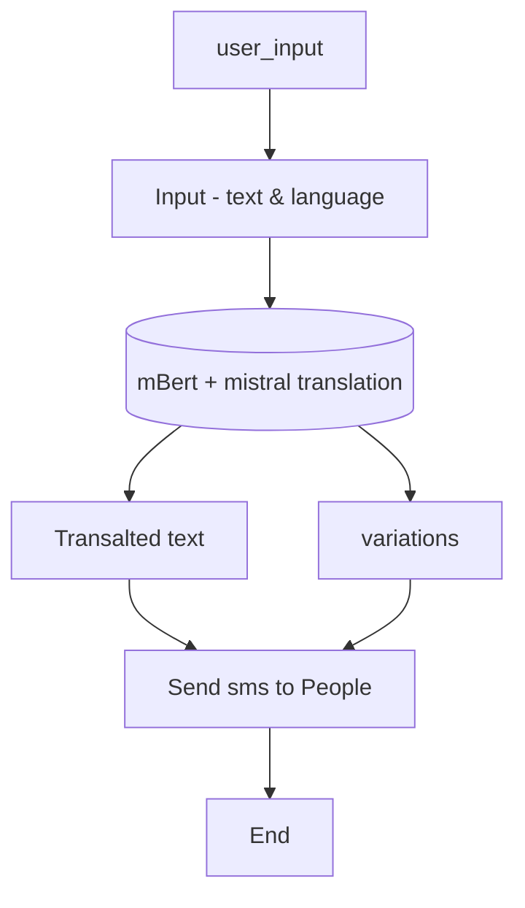

## Flowchart

```mermaid
graph TD;

A[user_input]

A --> B[Input - text & language];

B --> C[(mBert + mistral translation )];

C --> D[Transalted text];

C --> E[variations]

D --> F[Send sms to People];
E --> F;

F --> End;

```